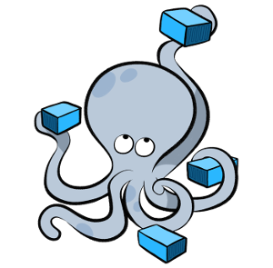

## Docker for Developers - Introduction

#### [CubanTech Meetups](http://www.meetup.com/CubanTech), 19 October 2019
#### [Docker Cuba Meetups](http://www.meetup.com/Docker-Cuba), 19 October 2019

###### [Marcos Maceo](https://github.com/stdevMac) / [@marcosmaceo](https://t.me/marcosmaceo)
###### [Adrian Paez](https://github.com/stdevAdrianPaez) / [@Wic97](https://t.me/Wic97)
###### [The CubanTech Group](http://cuban.tech) / [@TheCubanTech](http://twitter.com/TheCubanTech)
________________________

###### Get them: [online presentation](http://cubantech.github.io/docker-presentation/) / [source code](http://github.com/cubantech/docker-presentation) / [docker image](http://hub.docker.com/r/tplcom/docker-presentation/)

###### Under [Attribution 4.0 International](http://creativecommons.org/licenses/by/4.0/) license.

---

### Acknowledgements

#### Based on slides for presentation in [Python Meetup Thessaloniki](http://www.meetup.com/PyThess/), 15 April 2016

###### [TheodorosPloumis.com](http://www.theodorosploumis.com/en) / [@theoploumis](http://twitter.com/theoploumis)

---

### Let me ask you

- Who knows about [Docker](http://docker.com)?
- Who uses Docker for development?
- Who uses Docker in production?
- Who tried but could not do it?

---

### What is Docker

> Docker is an open platform for developing, shipping, and running applications.

> Docker allows you to package an application with all of its dependencies into a standardized unit for software development.

---

### Docker vs VMs


---

### Docker History

 - Solomon Hykes ([@solomonstre](http://twitter.com/solomonstre))
 - dotCloud (now Docker Inc)
 - March 2013
 - Apache 2.0 license
 - 30k stars on Github
 - 260k public repositories on hub.docker.com
 - Docker Inc acquires everyone <small><sup>TM</sup></small>
 - Docker joins the "[Open Container Initiative](http://www.opencontainers.org/)", June 2015

---

### Docker Benefits

 - Fast (deployment, migration, restarts)
 - Secure
 - Lightweight (save disk & CPU)
 - Open Source
 - Portable software
 - Microservices and integrations (APIs)
 - Simplify DevOps
 - Version control capabilities

---

### Common Docker usages

 - Sandbox environment (develop, test, debug, educate)
 - Continuous Integration & Deployment
 - Scaling apps
 - Development collaboration
 - Infrastructure configuration
 - Local development
 - Multi-tier applications
 - PaaS, SaaS

###### See the [survey results for 2016](http://www.docker.com/survey-2016)

---

### Technology behind Docker

 - Linux [x86-64](http://www.wikiwand.com/en/X86-64)
 - [Go](http://golang.org/) language
 - [Client - Server](http://www.wikiwand.com/en/Client%E2%80%93server_model) (deamon) architecture
 - Union file systems ([UnionFS](http://www.wikiwand.com/en/UnionFS): AUFS, btrfs, vfs etc)
 - [Namespaces](http://en.wikipedia.org/wiki/Cgroups#NAMESPACE-ISOLATION) (pid, net, ipc, mnt, uts)
 - Control Groups ([cgroups](http://www.wikiwand.com/en/Cgroups))
 - Container format ([libcontainer](http://github.com/opencontainers/runc/tree/master/libcontainer "Libcontainer provides a native Go implementation for creating containers with namespaces, cgroups, capabilities, and filesystem access controls. It allows you to manage the lifecycle of the container performing additional operations after the container is created."))

###### See more at [Understanding docker](http://docs.docker.com/engine/understanding-docker/)

---

### Docker components

 - (Docker) client
 - daemon
 - engine
 - machine
 - compose
 - swarm
 - registry

---

### Docker client

It is the primary user interface to Docker. It accepts commands from the user
and communicates back and forth with a Docker daemon.

---

### Docker daemon

It runs on a host machine. The user does not directly interact with the daemon,
but instead through the Docker client with the RESTful api or sockets.

---

### Docker engine

A Client with a Daemon as also as the docker-compose tool. Usually referred simply as "docker".

---

### Docker machine


A tool which makes it really easy to create Docker hosts on your computer,
on cloud providers and inside your own data center.
It creates servers, installs Docker on them, then configures the Docker client to talk to them.
Required for Mac, Windows users.

---

### Docker compose



A tool for defining and running complex applications with Docker
(eg a multi-container application) with a single file.

---

### Docker swarm


A native clustering tool for Docker. Swarm pools together several Docker
hosts and exposes them as a single virtual Docker host. It scale up to multiple hosts.

---

### Docker distribution


A (hosted) service containing repositories of images which responds to the Registry API.

---

### The Docker architecture


###### See more at [Understanding docker](http://docs.docker.com/engine/understanding-docker/)


---

### Steps of a Docker workflow

```
docker run -i -t -d python:3.7-alpine ls
```

 - Pulls the python:3.7-alpine [image](http://docs.docker.com/engine/userguide/containers/dockerimages/ "A read-only layer that is the base of your container. It can have a parent image to abstract away the more basic filesystem snapshot.") from the [registry](http://docs.docker.com/registry/ "The central place where all publicly published images live. You can search it, upload your images there and when you pull a docker image, it comes the repository/hub.")
 - Creates a new [container](http://docs.docker.com/engine/userguide/storagedriver/imagesandcontainers/ "A runnable instance of the image, basically it is a process isolated by docker that runs on top of the filesystem that an image provides.")
 - Allocates a filesystem and mounts a read-write [layer](http://docs.docker.com/engine/reference/glossary/#filesystem "A set of read-only files to provision the system. Think of a layer as a read only snapshot of the filesystem.")
 - Allocates a [network/bridge interface](http://www.wikiwand.com/en/Bridging_%28networking%29 "")
 - Sets up an [IP address](http://www.wikiwand.com/en/IP_address "An Internet Protocol address (IP address) is a numerical label assigned to each device (e.g., computer, printer) participating in a computer network that uses the Internet Protocol for communication.")
 - Executes a process that you specify (``` ls ```)
 - Captures and provides application output

---

### The docker image


---

### The docker container

.")

---

### The Dockerfile

> A Dockerfile is a text document that contains all the commands a user could call on the command line to create an image.

 - [Dockerfile with inline comments](http://github.com/cubantech/docker-presentation/blob/gh-pages/examples/dockerfile/Dockerfile) just for education
 - [Dockerfile reference](http://docs.docker.com/engine/reference/builder/) on docker docs
 - Official Dockerfiles ([rails](http://github.com/docker-library/rails/blob/master/Dockerfile), [nodejs](http://github.com/ReadyTalk/nodejs-docker/blob/master/base/Dockerfile), [django](http://github.com/docker-library/django/blob/master/3.4/Dockerfile), [Drupal](http://github.com/docker-library/drupal/blob/master/8.1/fpm/Dockerfile))

---

### Common Docker Commands

```
// General info
man docker // man docker-run
docker help // docker help run
docker info
docker version
docker network ls

// Images
docker images
docker pull [IMAGE]
docker push [IMAGE]

// Containers
docker run
docker ps // docker ps -a, docker ps -l
docker stop/start/restart [CONTAINER]
docker stats [CONTAINER]
docker top [CONTAINER]
docker port [CONTAINER]
docker inspect [CONTAINER]
docker inspect -f "{{ .State.StartedAt }}" [CONTAINER]
docker rm [CONTAINER]

```

---

### Docker examples

- SSH into a container
- Build an image
- Docker [Volume](http://docs.docker.com/engine/userguide/containers/dockervolumes/)
- [Linked](http://docs.docker.com/engine/userguide/networking/default_network/dockerlinks/) containers
- Using [docker-compose](http://docs.docker.com/compose/)
- Scale containers with docker-compose
- Share an image (share this presentation)
- Package an app with its environment
- Screen and sound within containers (x-forward)

---

### Example: SSH into a container

```
docker pull ubuntu
docker run -it --name ubuntu_example ubuntu /bin/bash
```

---

### Example: Build an Image

Let's build a [jenkins image](http://github.com/komljen/dockerfile-examples/blob/master/jenkins/Dockerfile)

```
cd ~/Docker-presentation
git clone git@github.com:komljen/dockerfile-examples.git.git
cd dockerfile-examples/jenkins
docker build -t jenkins-local .

// Test it
docker run -d -p 8099:8080 --name jenkins_example jenkins-local
// Open http://localhost:8099
```

---

Our local example

```bash
cd ~/docker-example
docker build -t example .

// Test it
docker run --rm -d -p 8000:8000 --name example example
// Open http://localhost:8000
```

---

### Example: Docker volume

Let's use [Apache server](http://bitbucket.org/EdBoraas/apache-docker/src/)

```
cd ~/Docker-presentation
mkdir apache-example
cd apache-example

docker pull eboraas/apache
docker run --name apache_volume_example \
           -p 8180:80 -p 443:443 \
           -v $(pwd):/var/www/ \
           -d eboraas/apache

// Locally create an index.html file
mkdir html
cd html
echo "It works using mount." >> index.html

// Open http://localhost:8180 to view the html file
```

---

```
mkdir html

docker run --name example \
           -p 8180:8000 \
           -v $(pwd)/html:/code \

// Locally create an index.html file
mkdir html
cd html
echo "It works using mount." >> index.html

// Open http://localhost:8180 to view the html file
```

---

### Example: Docker link containers

Let's create a FLask app

```
docker run --name redis -d redis:alpine
docker run -d --name flask \
	p 5000:5000 \
	--link redis:redis \
	python-flask

// Open http://localhost:5000

// There is a proper linking
docker inspect -f "{{ .HostConfig.Links }}" flask
```

---

### Example: Using Docker Compose

Let's create a Flask app with [docker-compose.yml](http://github.com/cubantech/docker-presentation/blob/gh-pages/examples/docker-compose/docker-compose.yml)

```
cat docker-compose.yml
docker-compose up -d
```

---

### Example: Share a public Image

```
docker build wic/myimage .

// Push it on the hub.docker.com
docker push wic/myimage
```

---

### Example: Export/Save/Load etc

```
docker run -d -p 8080:8000 --name python_server \
	python:3.7-alpine python3 -m http.server

// Create a file inside the container.
docker exec -it python_server \
	/bin/sh -c 'mkdir /test && echo "This is it." >> /test/test.txt'

// Test it. You should see message: "This is it."
docker exec python_server cat /test/test.txt

// Commit the change.
docker commit python_server python_server

// Create a new container with the new image.
docker run -p 8081:8000 -it --rm python_server

// Export the container as image
docker export python_server > python_server.tar

// Import a new image from the exported files
docker import python_server.tar python_server:new

// Save a new image as tar
docker save -o ~/python_server.tar python_server:new

// Load an image from tar file
docker load < python_server.tar

```

---

### Docker tips

There are known best practices (see a list at [examples/tips](http://github.com/cubantech/docker-presentation/tree/gh-pages/examples/tips))

- Optimize containers (check [fromlatest.io](http://www.fromlatest.io/) and [imagelayers.io](http://imagelayers.io))
- Create your own tiny base
- Containers are not Virtual Machines
- Full stack Images VS 1 process per Container
- Create your private registry
- Create shortcut commands
- Use docker-compose.yml templates (see why at [lorry.io](http://lorry.io/))
- Be aware of the hub.docker.com docker agent version

---

### The Docker war

| Type | Software |
|:----:|----------|
| Clustering/orchestration | [Swarm](http://docs.docker.com/swarm/), [Kubernetes](http://kubernetes.io/), [Marathon](http://mesosphere.github.io/marathon/), [MaestroNG](http://github.com/signalfx/maestro-ng), [decking](http://decking.io/), [shipyard](http://shipyard-project.com/) |
| Docker registries | [Portus](http://port.us.org/), [Docker Distribution](http://github.com/docker/distribution), [hub.docker.com](http://hub.docker.com), [quay.io](http://quay.io), [Google container registry](http://cloud.google.com/tools/container-registry/), [Artifactory](http://www.jfrog.com/artifactory/), [projectatomic.io](http://www.projectatomic.io/) |
| PaaS with Docker | [Rancher](http://rancher.com/), [Tsuru](http://tsuru.io/), [dokku](http://github.com/dokku/dokku), [flynn](http://flynn.io/),  [Octohost](http://octohost.io/), [DEIS](http://deis.io/) |
| OS made of Containers | [RancherOS](http://rancher.com/rancher-os/) |

---

### Docker Alternatives

- [Rocket, rkt](http://github.com/coreos/rkt)
- [Linux Containers, LXC](http://linuxcontainers.org/)
- [Linux container hypervisor, LXD](http://www.ubuntu.com/cloud/lxd)
- [BSD Jails](http://www.freebsd.org/doc/handbook/jails.html)
- [Solaris Zones](http://oracle.com/solaris)
- [drawbridge](http://research.microsoft.com/en-us/projects/drawbridge/)

---

### Instead of Resources

 - [Awesome Docker](http://github.com/veggiemonk/awesome-docker) (list of Docker resources & projects)
 - [Docker cheat sheet](http://github.com/wsargent/docker-cheat-sheet)
 - [Docker in Practice](http://www.manning.com/books/docker-in-practice), [The Docker Book](http://www.dockerbook.com/) (books)
 - [Docker aliases/shortcuts](http://github.com/cubantech/docker-presentation/tree/gh-pages/examples/shortcuts/docker-aliases.sh)
 - Docker [case studies](http://www.docker.com/customers)

---

### Questions?


[Review this presentation](http://goo.gl/lkau9t)

> Next: Docker in production, Scaling, Private registries, PaaS.

###### In this presentation I have used [oh my zsh](http://ohmyz.sh/), [docker 1.12.5](http://github.com/docker/docker/releases/tag/v1.12.5), [wharfee](http://github.com/j-bennet/wharfee) and [dry](http://github.com/moncho/dry).

