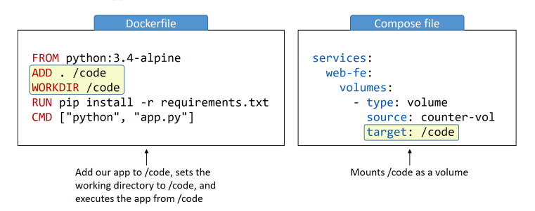

## Docker for Developers - Introduction

#### [CubanTech Meetups](http://www.meetup.com/CubanTech), 19 October 2019
#### [Docker Cuba Meetups](http://www.meetup.com/Docker-Cuba), 19 October 2019

###### [Marcos Maceo](https://github.com/stdevMac) / [@marcosmaceo](https://t.me/marcosmaceo)
###### [Adrian Paez](https://github.com/stdevAdrianPaez) / [@Wic97](https://t.me/Wic97)
###### [The CubanTech Group](http://cuban.tech) / [@TheCubanTech](http://twitter.com/TheCubanTech)
________________________

###### Get them: [online presentation](http://cubantech.github.io/docker-presentation/) / [source code](http://github.com/cubantech/docker-presentation) / [docker image](http://hub.docker.com/r/tplcom/docker-presentation/)

###### Under [Attribution 4.0 International](http://creativecommons.org/licenses/by/4.0/) license.

---

### Acknowledgements

#### Based on slides for presentation in [Python Meetup Thessaloniki](http://www.meetup.com/PyThess/), 15 April 2016

###### [TheodorosPloumis.com](http://www.theodorosploumis.com/en) / [@theoploumis](http://twitter.com/theoploumis)

---

### [Remembering](./1.html)


---

### Dockerfile in deep

#### Anatomy of a dockerfile

```
FROM python-alpine 

LABEL "maintainer"="some@example.com"
LABEL "rating"="Five Stars" "class"="First Class"

USER root

ENV APP /data/app

# Application Code
WORKDIR $APP 
COPY ./some.txt some.txt
RUN ls

CMD ["python3","-m","http.server"]
```

---

#### Base images

```
FROM python-alpine 
```

---

```
LABEL "maintainer"="some@example.com"
LABEL "rating"="Five Stars" "class"="First Class"
```

#### NOTE

MAINTAINER is a deprecated field in the Dockerfile specification. It was designed to
provided contact information for the Dockerfile’s author, but Docker now recommends
simply using a label for this purpose.

---

```
USER root

ENV APP /data/app
```

#### CAUTION

Even though containers provide some isolation from the underlying operating system, they
still run on the host kernel. Due to potential security risks, production containers should
almost always be run under the context of a nonprivileged user.

---

#### Code specific stuffs

```
# Application Code
WORKDIR $APP 
COPY ./some.txt some.txt
RUN ls
```

---

### Command for the image

```
CMD ["python3","-m","http.server"]
```

---

### ADD vs COPY

```
Copy just copy
COPY src dest
```

```
Add download from urls and decompress .tar files
ADD src dest
```

---


### Entrypoint

`ENTRYPOINT` has two forms:
```
ENTRYPOINT ["executable", "param1", "param2"] (exec form, preferred)
ENTRYPOINT command param1 param2 (shell form)
```

---

### ENTRYPOINT vs CMD

#### ONLY ENTRYPOINT

```
FROM python-alpine
ENTRYPOINT ["ping", "localhost"]
```

#### OVERRYDING

```
docker run --entrypoint=ping test-some google.com
```

---

#### ONLY CMD

```
FROM ubuntu:trusty
CMD ["/bin/ping","localhost"]
```

---

#### ENTRYPOINT and CMD

```
FROM ubuntu:trusty
ENTRYPOINT ["/bin/ping","-c","3"]
CMD ["localhost"]
```

---

### Building the image

```
docker build -t example/docker­example:latest .
```

---

### MultiStage builds

```go
package main

import (
	"fmt"
	"log"
	"net/http"
)

const (
	serverAddress = ":3030"
)

func handler(w http.ResponseWriter, r *http.Request) {
	fmt.Println("welcome");
	fmt.Fprintf(w, "Hello welcome %s!", r.URL.Path[1:])
}

func main() {
	http.HandleFunc("/", handler)

	log.Println("Listening on port ", serverAddress)
	log.Fatal(http.ListenAndServe(serverAddress, nil))
}
```

---

### The dockerfile

```
FROM golang:1.12.6-alpine3.10 AS builder
ADD . /app/backend
WORKDIR /app/backend
RUN CGO_ENABLED=0 GOOS=linux GOARCH=amd64 go build -a -o /main .

# final stage
FROM alpine:latest
COPY --from=builder /main ./
RUN chmod +x ./main
ENTRYPOINT ["./main"]
EXPOSE 3030
```

---

### Docker-compose

We'll look at how to deploy multi-container applications using Docker
Compose.

---

Docker Compose and Docker Stacks are very similar. In this chapter we'll focus
on Docker Compose, which deploys and manages multi-container applications on
Docker nodes operating in single-engine mode. In a later chapter, we'll focus on
Docker Stacks. Stacks deploy and manage multi-container apps on Docker nodes
operating in Swarm mode.

---

### Deploying apps with Compose

Most modern apps are made of multiple smaller services that interact to form a useful app. We call this microservices. A  imple example might be an app with the following four services:

- web front-end
- ordering
- catalog
- back-end database

---

### Compose background

In the beginning was `fig`. `Fig` was a powerful tool, created by a company called Orchard, and it was the best way to manage multi-container Docker apps. It was a Python tool that sat on top of Docker, and allowed you to define entire multi-container apps in a single YAML file. You could then deploy the app with the `fig` command-line tool. `Fig` could even manage the entire life-cycle of the app.

Behind the scenes, `fig` would read the YAML file and deploy and manage the app via the Docker API. It was a good thing!

---

### Compose files

The default name for the Compose YAML file is docker-compose.yml . However, you can use the `-f` flag to specify custom filenames.

---

#### Simple Example

```
version: "3.5"
services:
    web-fe:
        build: .
        command: python app.py
        ports:
            - target: 5000
              published: 5000
        networks:
            - counter-net
        volumes:
            - type: volume
              source: counter-vol
              target: /code
    redis:
        image: "redis:alpine"
        networks:
            counter-net:

networks:
    counter-net:

volumes:
    counter-vol:
```

---

- `version`: is mandatory, and it's always the first line at the root of the file.
This defines the version of the Compose file format (basically the API). You should
normally use the latest version.

- `services`: is where we define the different application services. The
example we’re using defines two services; a web front-end called `web-fe` , and an in-
memory database called redis . Compose will deploy each of these services as its
own containe

---

- `networks`: tells Docker to create new networks. By default, Compose
will create `bridge` networks. These are single-host networks that can only connect
containers on the same host. However, you can use the `driver` property to specify
different network types.

- `volumes`: is where we tell Docker to create new volumes.

---

### Deploying an app with Compose

In this section, we’ll deploy the app defined in the Compose file from the previous section. To do this, you'll need the following 4 files from https://github.com/nigelpoulton/counter-app:

- Dockerfile
- app.py
- requirements.txt
- docker-compose.yml

---

Let's quickly describe each file:

- `app.py` is the application code (a Python Flask app)
- `docker-compose.yml` is the Docker Compose file that describes how Docker should deploy the app
- `Dockerfile` describes how to build the image for the web-fe service
- `requirements.txt` lists the Python packages required for the app

---

Run command `docker-compose up` for start the app

Now that the app is built and running, we can use normal docker commands to view the images, containers, networks, and volumes that Compose created.

---

### Managing an app with Compose

- `docker-compose up`: is the command we use to deploy a Compose app. It expects the Compose file to be called docker-compose.yml or docker-compose.yaml ,but you can specify a custom filename with the -f flag. It’s common to start the app in the background with the -d flag.
- `docker-compose stop`: will stop all of the containers in a Compose app without deleting them from the system. The app can be easily restarted with `docker-compose restart`.
- `docker-compose rm`: will delete a stopped Compose app. It will delete containers and networks, but it will not delete volumes and images.

---

- `docker-compose restart`: will restart a Compose app that has been stopped with docker-compose stop . If you have made changes to your Compose app since stopping it, these changes will not appear in the restarted app. You will need to re-deploy the app to get the changes.
- `docker-compose ps`: will list each container in the Compose app. It shows current state, the command each one is running, and network ports.
- `docker-compose top`: list the processes running inside of each service (container)
- `docker-compose down`: will stop and delete a running Compose app. It deletes containers and networks, but not volumes and images.

---

### Understand volumes on docker-compose



---

### Docker Swarm

---

#### Few presentations away..

---